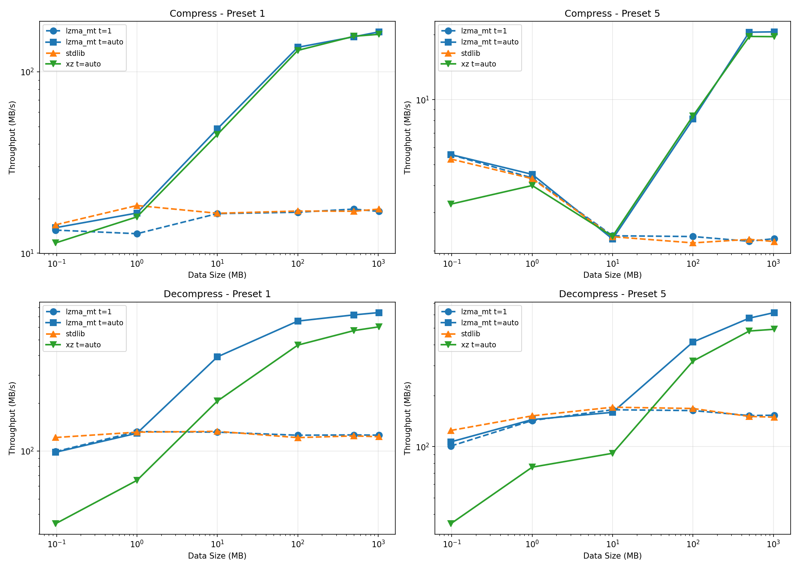

# lzma_mt

Multi-threaded LZMA/XZ compression for Python.

A drop-in replacement for Python's `lzma` module with multi-threading support, implemented as a Cython wrapper around liblzma.

## Installation

```bash
pip install lzma-mt
```

### Build from source

Requires liblzma development headers:

```bash
# Ubuntu/Debian
sudo apt install liblzma-dev

# macOS
brew install xz

# Fedora/RHEL
sudo dnf install xz-devel
```

Then install:

```bash
pip install .
```

## Usage

### Quick start

```python
import lzma_mt

# Compress with 4 threads
compressed = lzma_mt.compress(data, threads=4)

# Decompress with 4 threads
decompressed = lzma_mt.decompress(compressed, threads=4)

# Use threads=0 for auto-detect based on CPU count
compressed = lzma_mt.compress(data, threads=0)
```

### Drop-in replacement for lzma

The API matches Python's `lzma` module exactly, with an additional `threads` parameter:

```python
import lzma_mt

# One-shot compression/decompression
compressed = lzma_mt.compress(data, preset=6, threads=4)
decompressed = lzma_mt.decompress(compressed, threads=4)

# Streaming compression
compressor = lzma_mt.LZMACompressor(preset=6, threads=4)
out = compressor.compress(chunk1)
out += compressor.compress(chunk2)
out += compressor.flush()

# Streaming decompression
decompressor = lzma_mt.LZMADecompressor(threads=4)
result = decompressor.decompress(compressed)

# File I/O
with lzma_mt.open("file.xz", "wb", threads=4) as f:
    f.write(data)

with lzma_mt.open("file.xz", "rb", threads=4) as f:
    data = f.read()
```

### All lzma constants are available

```python
from lzma_mt import (
    FORMAT_XZ, FORMAT_ALONE, FORMAT_RAW, FORMAT_AUTO,
    CHECK_CRC64, CHECK_SHA256, CHECK_NONE,
    PRESET_DEFAULT, PRESET_EXTREME,
    # ... all other lzma constants
)
```

## Thread parameter

The `threads` parameter controls parallelism:

| Value | Behavior |
|-------|----------|
| `1` | Single-threaded (default, matches stdlib behavior) |
| `0` | Auto-detect based on CPU count |
| `N` | Use N threads |

Multi-threading is only used for XZ format (`FORMAT_XZ`). Other formats fall back to single-threaded stdlib implementation.

## Security

### CVE-2025-31115

xz-utils versions 5.3.3alpha through 5.8.0 have a use-after-free vulnerability in the multi-threaded decoder. This module:

- Checks the xz-utils version at runtime
- Raises `RuntimeError` if a vulnerable version is detected with `threads != 1`
- Allows single-threaded mode (`threads=1`) on any version

Check your system:

```python
import lzma_mt

print(lzma_mt.get_xz_version())      # e.g., "5.8.1"
print(lzma_mt.is_mt_decoder_safe())  # True if safe for MT decoding
```

### Memory limits

When decompressing untrusted data, always set a memory limit:

```python
# Limit memory to 100 MB
lzma_mt.decompress(data, memlimit=100 * 1024 * 1024, threads=4)

# Or with streaming
decompressor = lzma_mt.LZMADecompressor(memlimit=100 * 1024 * 1024, threads=4)
```

## Thread safety

Compressor and decompressor instances are internally locked and safe to use from multiple Python threads. However:

- **Compressor**: Interleaved `compress()` calls produce output in undefined order
- **Decompressor**: Decompression is inherently sequential

For predictable results, use one instance per thread.

## Performance

Multi-threaded compression scales well with CPU cores. Decompression scaling depends on the compressed data having multiple independent blocks.

Benchmarks on Wikipedia text (enwik8), comparing lzma_mt, Python's stdlib lzma, and the xz command-line tool (AMD Ryzen 9 5900X, 12 cores / 24 threads, 64 GB RAM):



- **Compression**: lzma_mt matches xz binary speed (both use liblzma)
- **Decompression**: lzma_mt is ~20-25% faster than xz due to no subprocess overhead
- **Threading**: Significant speedups at larger data sizes (4-8x with auto threads)

```python
import lzma_mt
import time

data = b"x" * 100_000_000  # 100 MB

# Single-threaded
t0 = time.time()
lzma_mt.compress(data, threads=1)
print(f"1 thread: {time.time() - t0:.2f}s")

# Multi-threaded
t0 = time.time()
lzma_mt.compress(data, threads=0)
print(f"Auto threads: {time.time() - t0:.2f}s")
```

## API Reference

### Functions

- `compress(data, format=FORMAT_XZ, check=-1, preset=None, filters=None, *, threads=1)` - Compress data
- `decompress(data, format=FORMAT_AUTO, memlimit=None, filters=None, *, threads=1)` - Decompress data
- `open(filename, mode="rb", *, format=None, check=-1, preset=None, filters=None, encoding=None, errors=None, newline=None, threads=1)` - Open an LZMA file
- `is_check_supported(check)` - Check if integrity check type is supported
- `get_xz_version()` - Return xz-utils version string
- `is_mt_decoder_safe()` - Check if MT decoder is safe from CVE-2025-31115

### Classes

- `LZMACompressor(format=FORMAT_XZ, check=-1, preset=None, filters=None, *, threads=1)` - Streaming compressor
- `LZMADecompressor(format=FORMAT_AUTO, memlimit=None, filters=None, *, threads=1)` - Streaming decompressor
- `LZMAFile(filename, mode="r", *, format=None, check=-1, preset=None, filters=None, threads=1)` - File object for LZMA files
- `LZMAError` - Exception for LZMA errors

## License

MIT
